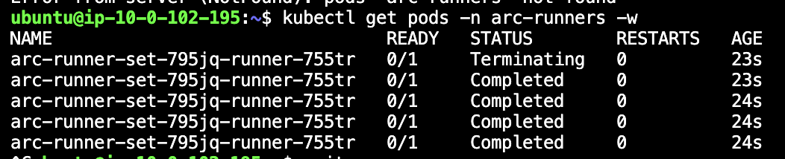
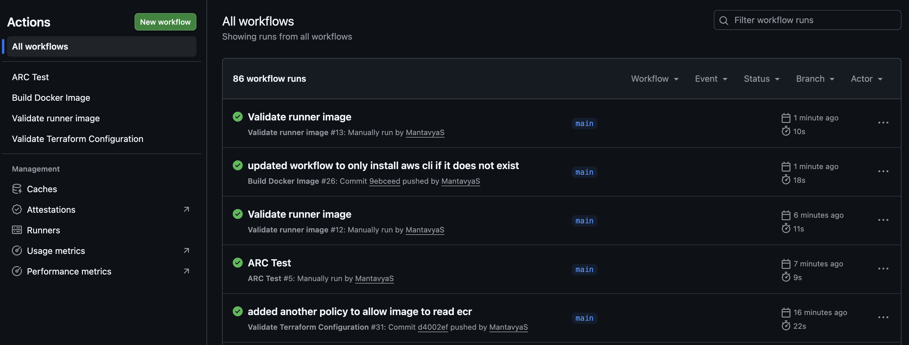
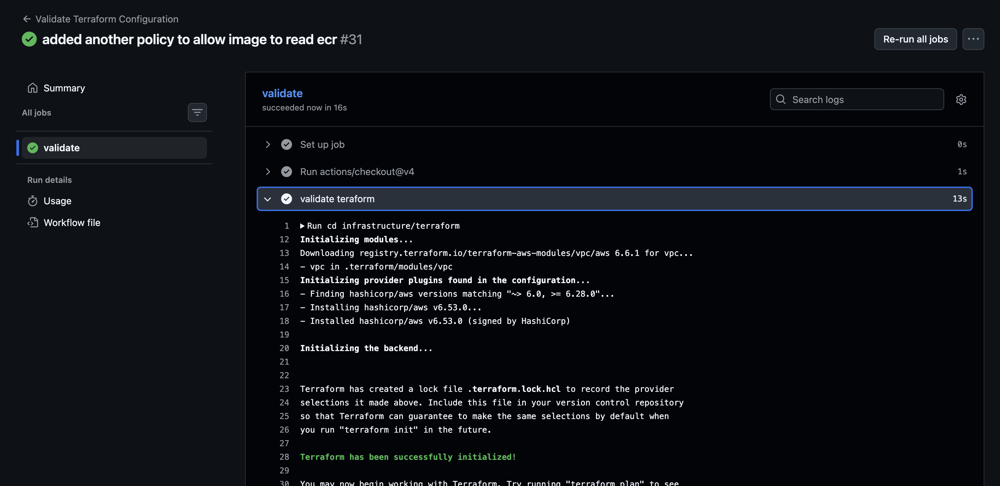
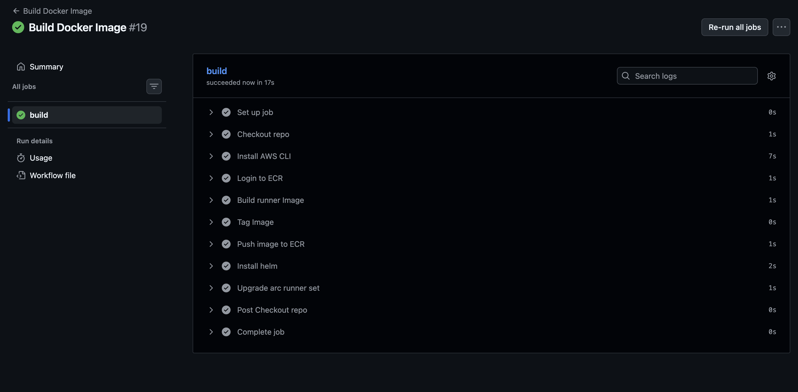
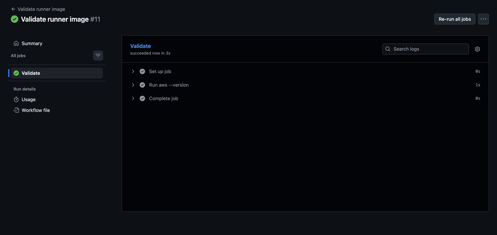
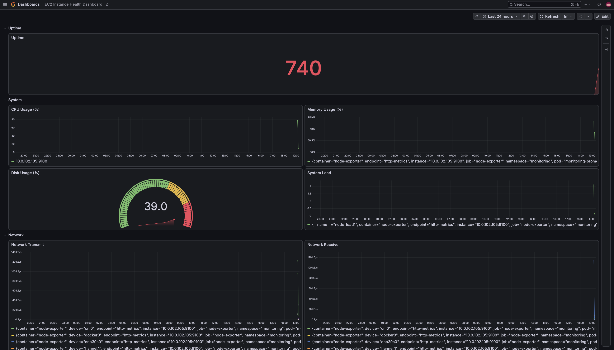
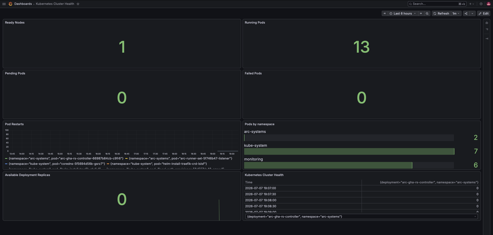
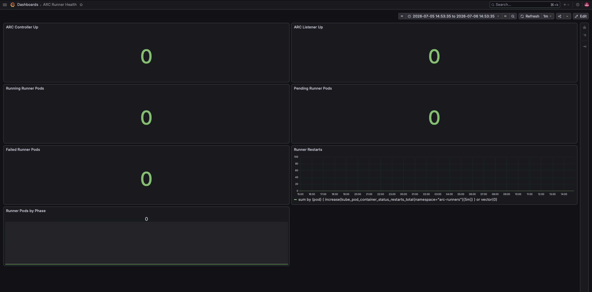
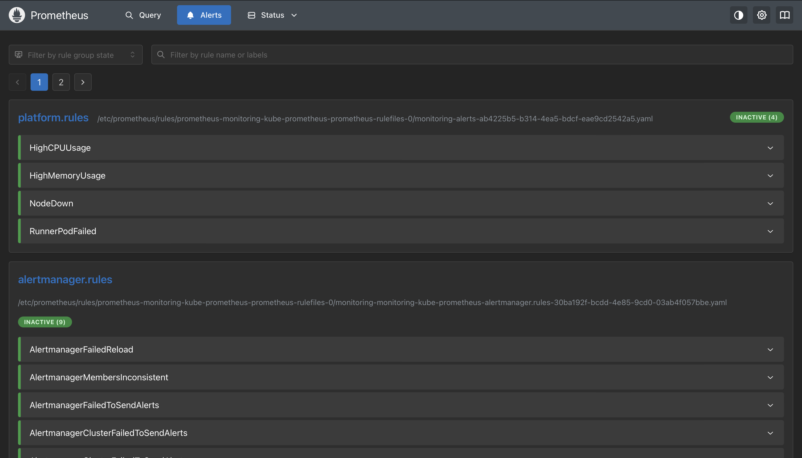

# Secure Self-Hosted CI Platform

A self-hosted CI platform that provisions its own infrastructure, executes GitHub Actions workloads inside Kubernetes, and monitors itself, all inside AWS infrastructure I own end-to-end rather than on GitHub-hosted runners.

The platform uses Terraform to provision the underlying AWS infrastructure, Kubernetes (K3s) with the GitHub Actions Runner Controller (ARC) to automatically create ephemeral runners whenever jobs are queued and destroy them once they complete, and a Prometheus/Grafana stack to monitor both the infrastructure and the CI platform itself. This removes the need for persistent runners, reduces idle infrastructure costs, and isolates every workflow execution in its own environment.

The project was built using AWS, Terraform, K3s, ARC, Prometheus, and Grafana.

---

## Why I Built This

This project was a direct follow-up to an issue I identified in an earlier deployment project.

That project used GitHub Actions to deploy to an EC2 instance over SSH, which required opening port 22 to the internet so that GitHub's infrastructure could reach the server. While access was restricted with SSH keys, exposing SSH publicly still felt like an unnecessary risk.

I wanted to explore whether it was possible to completely remove inbound access requirements and keep CI workloads entirely inside infrastructure that I controlled.

The solution was to move the runner itself inside the VPC.

Instead of GitHub connecting to my infrastructure, infrastructure inside my VPC connects outward to GitHub, polls for work, and pulls jobs when they become available.

This approach also allows workflows to access private resources that GitHub-hosted runners would not normally be able to reach, such as:

* Internal APIs
* Databases
* Private services
* Infrastructure that does not expose public endpoints

---

## Architecture


*Diagram: VPC layout, EC2/K3s node, ARC controller and runner pods, monitoring stack, GitHub App auth flow*

When a workflow is triggered:

1. GitHub queues the workflow against a self-hosted runner group.
2. ARC detects the queued job using GitHub App authentication.
3. ARC creates a new ephemeral runner pod inside Kubernetes.
4. The runner pod pulls the job and executes it.
5. Once the workflow finishes, the runner pod is automatically destroyed.

If no workflows are waiting to run, no runner pods exist and the cluster scales back down to only the ARC controller components.

This means:

* no idle runners
* no shared state between jobs
* no cleanup required between executions

---

## Infrastructure Provisioning

Every piece of this platform (networking, compute, container registry, secrets, and the Kubernetes layer itself) is defined as code and reproducible from a single `terraform apply`. Nothing was provisioned by hand through the AWS console.

Resources created by Terraform include:

* VPC
* Public and private subnets
* Security groups
* IAM roles and policies
* EC2 instance
* Elastic Container Registry (ECR)
* AWS Secrets Manager secrets

A bootstrap script runs automatically when the EC2 instance launches and installs:

* Docker
* K3s
* Helm
* kubectl
* AWS CLI
* supporting dependencies required by the cluster

This allows the entire environment, from raw AWS account to a fully running Kubernetes CI platform, to be recreated from scratch with a single command and minimal manual setup.

---

## Kubernetes Platform

### Why K3s?

I chose K3s instead of EKS because this project only required a single-node Kubernetes cluster and I wanted to avoid the cost and operational overhead of running a managed control plane. This was a deliberate infrastructure tradeoff for a personal-scale platform, not a shortcut. the underlying design (ARC, namespacing, autoscaling, monitoring) is the same regardless of which Kubernetes distribution sits underneath it, and would map directly onto EKS if this needed to scale to a team or organization.

K3s provided:

* a full Kubernetes API
* a lightweight installation process
* lower infrastructure costs
* compatibility with standard Kubernetes tooling

---

### Actions Runner Controller

The GitHub Actions Runner Controller manages the entire runner lifecycle.

ARC is responsible for:

* registering runners with GitHub
* creating runners when jobs are queued
* destroying runners after jobs complete
* scaling runner capacity based on workload demand

Every workflow receives a completely fresh runner environment.

This avoids configuration drift and prevents jobs from interfering with one another.

---

### Namespace Layout

The cluster is separated into dedicated namespaces.

#### arc-systems

Contains:

* ARC controller
* listener pods

These components remain running continuously and communicate with GitHub to monitor for queued jobs.

#### arc-runners

Contains:

* ephemeral runner pods

Runner pods only exist while workflows are actively executing.



---

## Custom Runner Image

Most workflows required tools such as Terraform, kubectl, and the AWS CLI.

Installing these dependencies during every workflow execution would increase build times significantly, so I designed and built a custom runner image, with its own build pipeline pushing to Amazon ECR whenever the image changes.

The image includes:

* Docker CLI
* AWS CLI
* Terraform
* kubectl
* Helm
* Python
* Git
* common Linux utilities

Using a prebuilt image allows workflows to begin execution immediately without additional setup steps.

---

## Authentication and Security

Security was one of the primary motivations behind the project, and it was treated as a design constraint from the start rather than something bolted on afterward.

#### GitHub App Authentication

Runner authentication uses a GitHub App rather than a Personal Access Token.

This provides:

* short-lived credentials
* reduced permission scope
* automatic credential rotation
* organization-level runner management


#### Secrets Management

The GitHub App private key is stored in AWS Secrets Manager rather than inside the repository or Terraform code.

This prevents sensitive credentials from being committed to source control and simplifies secret rotation.

#### Runner Isolation

Every workflow executes inside its own runner pod.

Once the workflow finishes:

* the pod is deleted
* all temporary files disappear
* no state persists into future jobs

This reduces the impact of compromised workflows and prevents contamination between builds.

#### Fork Protection

Workflows originating from forked repositories are prevented from running on self-hosted runners.

This protects infrastructure from arbitrary code execution originating from untrusted pull requests.

---

## CI Workflows



The platform currently supports several internal workflows, and the platform itself is a consumer of the CI system it provides. Infrastructure changes are validated and changes to the runner image are deployed through the same pipeline that runs everyone else's jobs.

#### Terraform Validation



Runs automatically when infrastructure code changes and performs:

* terraform fmt
* terraform init
* terraform validate

#### Runner Image Build



Builds the custom runner image and pushes it to Amazon ECR whenever the runner image changes.

#### Runner Image Validation



Checks that the runner has all dependencies required to execute the workflows properly installed.

---

## Monitoring and Observability

Prometheus, Grafana, and Alertmanager run inside the same Kubernetes cluster as the runners. The full monitoring stack — metrics collection, dashboards, and alert rules — was configured and provisioned from scratch, not deployed from a managed/hosted observability service.

The monitoring stack provides visibility into both infrastructure health and CI platform health.

### EC2 Dashboard



Tracks:

* CPU usage
* memory usage
* disk usage
* network throughput

---

### Kubernetes Dashboard



Tracks:

* node health
* pod status
* namespace resource usage
* pod restart counts

---

### ARC Dashboard



Tracks:

* runner availability
* active runners
* failed runners
* controller health

---

### Alerting



Alert rules currently exist for:

* high CPU usage
* high memory usage
* node failures
* failed runner pods

---

## Challenges & Lessons Learned

* **ARC/Helm release instability**: the Helm release for the runner scale set has occasionally ended up in a corrupted state after changes, requiring a full uninstall and reinstall of the ARC release to recover. Root cause is still being investigated; next step is pinning chart versions more strictly and testing upgrades in isolation before applying them to the running cluster.
* **GitHub App and runner group configuration**: getting registration and permissions correctly aligned took iteration; the setup was first validated at the repository level before being migrated to organization-level runner groups once it was confirmed working end-to-end.
* **ECR authentication from inside the cluster**: required correctly wiring IAM permissions so runner pods could pull the custom image without failures.
* **Secrets Manager deletion conflicts**: AWS enforces a recovery window on deleted secrets, which caused conflicts when re-provisioning infrastructure with the same secret names during iteration.
* **Grafana dashboard provisioning**: some exported dashboard JSON wasn't directly compatible with the Grafana API and needed adjustment before automated provisioning worked reliably.

---

## Repository Structure

```text
.
├── .github/workflows/          # GitHub Actions workflows
├── docker/runner/              # Custom runner image
├── helm/                       # ARC Helm configuration
├── infrastructure/terraform/   # Terraform infrastructure
├── kubernetes/                 # Kubernetes manifests
├── monitoring/
│   ├── alerts/                 # Alert rules
│   └── dashboards/             # Grafana dashboards
└── docs/
```

---

## Tech Stack

### Cloud & Infrastructure

* AWS
* EC2
* VPC
* IAM
* ECR
* Secrets Manager
* Terraform

### Kubernetes

* K3s
* Helm
* Actions Runner Controller

### CI/CD

* GitHub Actions
* GitHub App authentication

### Monitoring

* Prometheus
* Grafana
* Alertmanager

### Container Tooling

* Docker
* AWS CLI
* Terraform
* kubectl
